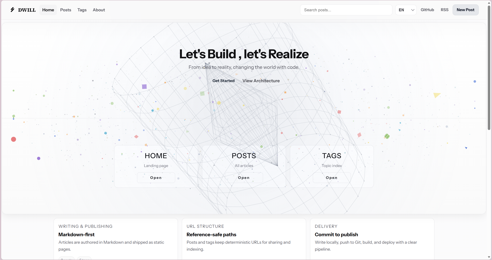

# DWILL Blog

Production-ready Astro blog for `blog2.dwill.top`.

Repository: <https://github.com/AVIDS2/blog>

## Highlights

- Static-first architecture, minimal runtime overhead.
- Markdown-driven content system with structured frontmatter.
- Built-in rendering for table, code block, LaTeX, and ECharts.
- Multilingual navigation/content flow (zh/en).
- SEO essentials included: sitemap, RSS, canonical, JSON-LD.
- Cloudflare Pages Git auto-deploy ready.

## Preview




## Stack

- Astro 5
- TypeScript
- Tailwind CSS
- KaTeX (`remark-math` + `rehype-katex`)
- ECharts (client loader)

## Local Development

```bash
npm install
npm run dev
```

Build and preview:

```bash
npm run build
npm run preview
```

## Content Workflow

Write posts in `src/content/posts/` using Markdown frontmatter:

```md
---
title: "Post title"
description: "One-line summary for SEO and feed."
date: "2026-02-12"
updated: "2026-02-12"
tags: ["architecture", "performance"]
draft: false
---
```

## Project Structure

```text
src/
  components/
  content/posts/
  layouts/
  pages/
public/
  images/posts/<slug>/
docs/
  image/preview/
```

## Cloudflare Pages Deployment

Use Git integration with repo `AVIDS2/blog`:

- Production branch: `main`
- Build command: `npm run build`
- Build output directory: `dist`
- Root directory: _(empty)_

After first setup, every `git push` to `main` triggers automatic deployment.

## VPS Migration

No architecture rewrite needed:

```bash
git pull
npm ci
npm run build
```

Then serve `dist/` via Nginx/Caddy/any static file server.

## Encoding (Windows)

Save source and markdown files as UTF-8 to avoid Chinese garbled text.
